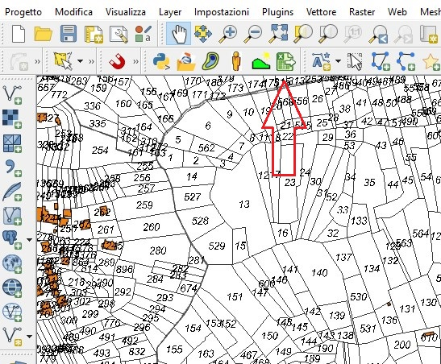
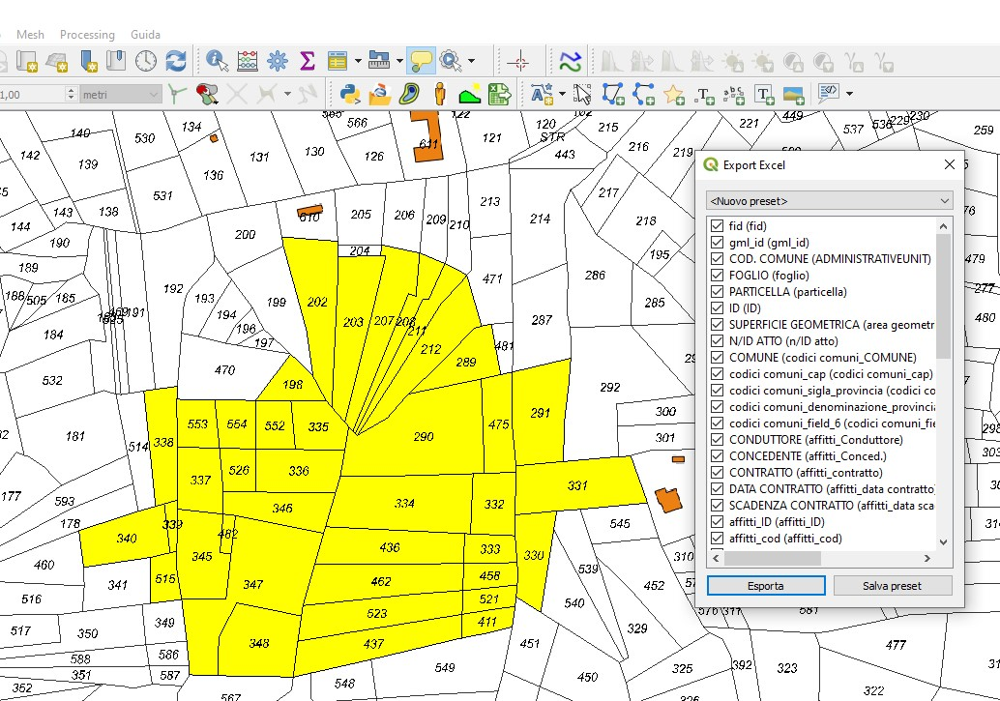
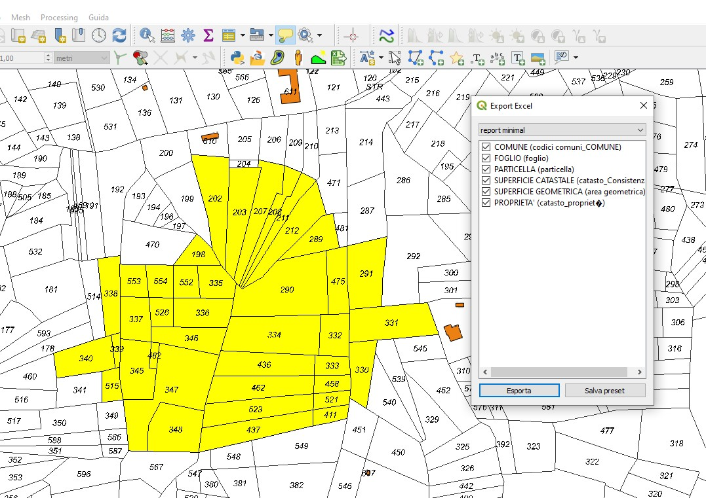
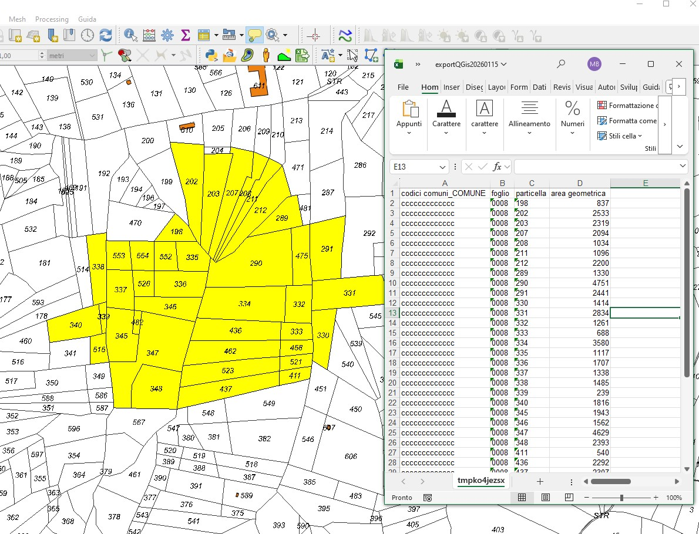

EN

# Export Excel (QGIS Plugin)

QGIS plugin to export selected features from a vector layer to Excel (XLSX).

## Description

It allows users to select and reorder fields using drag & drop, use attribute aliases
as Excel headers, and save reusable named presets per layer.
The export produces clean Excel files without geometries, with automatic column width
adjustment and no file-locking issues on Windows.

## Main features

- Export selected features only
- Field ordering via drag & drop
- Attribute aliases as Excel headers
- Named presets stored per layer
- Automatic column width adjustment
- No geometry export
- Safe Excel creation (no locked files)
- Toolbar and menu integration

## Usage

1. Select features in a vector layer
2. Click **Export Excel**
3. Choose a preset or select and order fields
4. Save the preset
5. Export to XLSX

## Screenshots

## Requirements

QGIS Desktop ≥ 3.40 LTR

## License

MIT

***************************************

IT

# Export Excel (QGIS Plugin)

Plugin QGIS per esportare in formato Excel (XLSX) le features selezionate
di un layer vettoriale.

## Descrizione

Consente di scegliere e ordinare i campi tramite drag & drop, utilizzare
gli alias degli attributi come intestazioni Excel e salvare preset riutilizzabili
specifici per ogni layer.
L’esportazione genera file Excel puliti, senza geometrie, con larghezza delle
colonne adattata automaticamente al contenuto e senza problemi di file bloccati
su Windows.

## Funzionalità principali

- Esportazione solo delle feature selezionate
- Ordinamento campi con drag & drop
- Utilizzo degli alias attributo come intestazioni Excel
- Preset nominati, salvati per singolo layer
- Larghezza colonne automatica
- Nessuna geometria esportata
- File Excel sicuri e immediatamente modificabili
- Integrazione con barra strumenti e menu QGIS

## Uso

1. Selezionare features in un layer vettoriale
2. Click **Export Excel**
3. Scegliere un preset oppure selezionare/ordinare i campi
4. Memorizzare eventualmente con un nome il preset
5. Esportare in XLSX

## Screenshots

## Requirements

QGIS Desktop ≥ 3.40 LTR

## License

MIT
